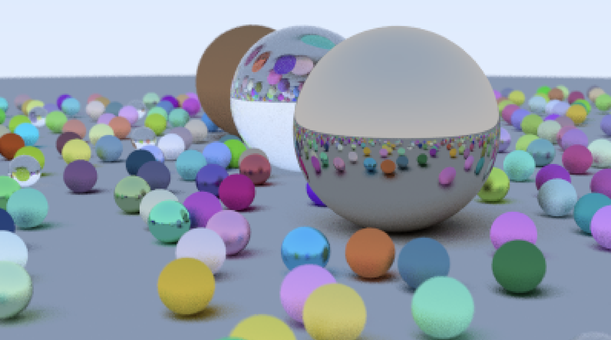

# RayTracer
Mini Ray tracer from [ray tracing in one weekend](https://raytracing.github.io/books/RayTracingInOneWeekend.html).

The project is built with bazel.

To run, cd to the root directory of the project and enter the following:
```
bazel run //:ray_tracer > image.ppm
```

The final image looks something like the following: 



## Potential Optimization
The program runs very slow when the number of spheres is large in the scene as the computation is running on CPU and executed sequentially even though
the operations on each pixel is highly parallelizable.  It is possible to speed things up by chunking blocks of pixels and parallize each block with threads.
Or better yet, use GPU for the computation.  
